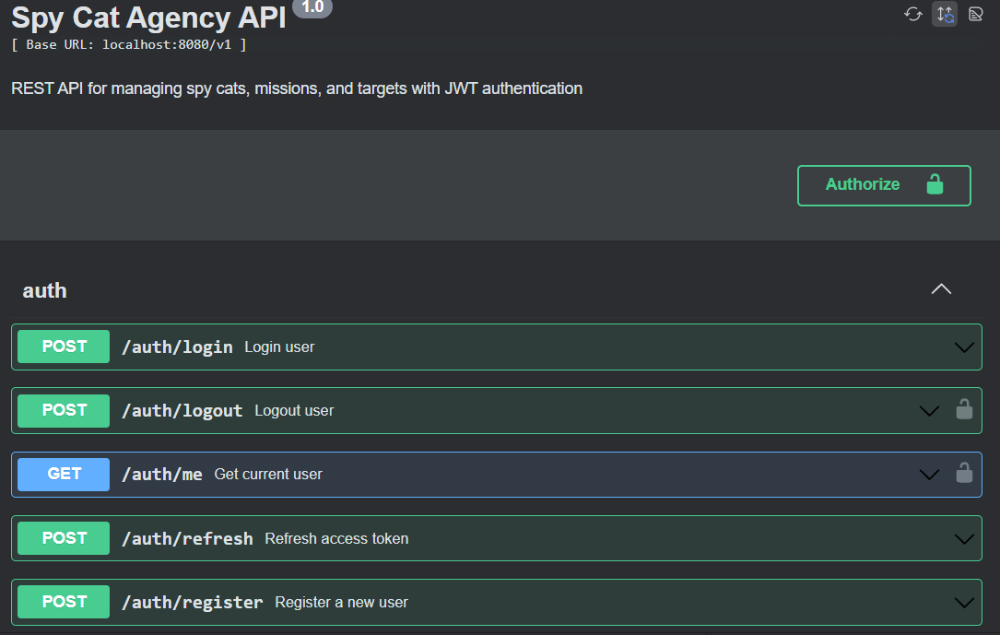
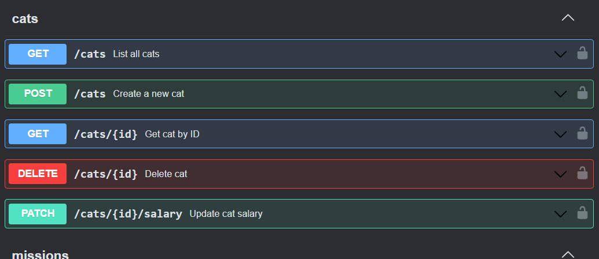
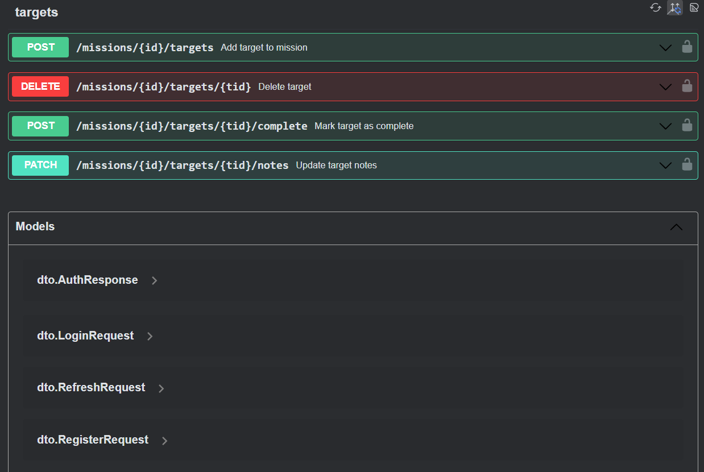

# Spy Cat Agency API

REST API for managing spy cats, missions, and targets with JWT authentication.

## Prerequisites
- Go 1.23+
- Docker & Docker Compose
- Make
- OpenSSL (for SSL certificates)

## Quick Start

### Ultra-Fast Start (Recommended for Quick Testing)

**Option A: With Make (Recommended)**
```bash
git clone https://github.com/Takatochi/DevelopsToday.git
cd DevelopsToday
cp .env.example .env
# Edit .env file if needed
make quick-lite        # Start API + DB + Redis (no SSL setup needed)
```

**Option B: Without Make (Pure Docker)**
```bash
git clone https://github.com/Takatochi/DevelopsToday.git
cd DevelopsToday
cp .env.example .env
# Edit .env file if needed
swag init -g internal/controller/http/controller.go -o docs  # Generate docs (optional)
docker-compose -f docker-compose.lite.yml up -d --build     # Start services
```

**Access**: http://localhost:8080/swagger/index.html

**Note**: Option A uses Make for automation, Option B uses pure Docker commands. Both achieve the same result.

### For Reviewers/Evaluators (Full Setup)

**Option A: With Make (Automated)**
```bash
git clone https://github.com/Takatochi/DevelopsToday.git
cd DevelopsToday
cp .env.example .env
# Edit .env file if needed
make reviewer-setup    # Complete setup + start all services with SSL
```

**Option B: Without Make (Manual)**
```bash
git clone https://github.com/Takatochi/DevelopsToday.git
cd DevelopsToday
# Generate SSL certificates
openssl req -x509 -nodes -days 365 -newkey rsa:2048 \
  -keyout ssl/nginx.key -out ssl/nginx.crt \
  -subj "/C=US/ST=State/L=City/O=Organization/CN=localhost"
# Generate Swagger docs
swag init -g internal/controller/http/controller.go -o docs
# Start all services
docker-compose up -d --build
```

**Access**: https://localhost/swagger/index.html

### Standard Quick Start (with SSL)

**Option A: With Make**
```bash
git clone https://github.com/Takatochi/DevelopsToday.git
cd DevelopsToday
cp .env.example .env
# Edit .env file if needed
make ssl-generate      # Generate SSL certificates
make docker-compose-up # Start all services
```

**Option B: Without Make**
```bash
git clone https://github.com/Takatochi/DevelopsToday.git
cd DevelopsToday
cp .env.example .env
# Edit .env file if needed
# Create SSL directory and generate certificates
mkdir -p ssl
openssl req -x509 -nodes -days 365 -newkey rsa:2048 \
  -keyout ssl/nginx.key -out ssl/nginx.crt \
  -subj "/C=US/ST=State/L=City/O=Organization/CN=localhost"
# Start services
docker-compose up -d --build
```

## Access Points
- **API (HTTPS)**: https://localhost/v1
- **API (HTTP)**: http://localhost:8080/v1
- **Swagger Docs**: https://localhost/swagger/index.html
- **Health Check**: https://localhost/health

## Test Credentials
```
Username: admin
Password: admin123
Role: admin
```
## Setup Methods

### Method 1: Reviewer Setup (Recommended)
1. Clone the repository:
   ```bash
   git clone https://github.com/Takatochi/DevelopsToday.git
   cd DevelopsToday
   ```
2. Perfect for reviewers and evaluators - sets up everything automatically:
    ```bash
    make reviewer-setup    # Complete automated setup
    make reviewer-test     # Run comprehensive test suite
    ```

### Method 2: Manual Setup
1. Clone the repository:
   ```bash
   git clone https://github.com/Takatochi/DevelopsToday.git
   cd DevelopsToday
   ```

2. Set up environment variables (optional):
   ```bash
   cp .env.example .env
   # Edit .env file if needed
   ```

3. Start services:
   ```bash
   make ssl-generate           # Generate SSL certificates
   make docker-compose-up      # Start all services
   ```

### Method 3: Step-by-step
```bash
make install-tools          # Install development tools
make deps                   # Download dependencies
make ssl-generate          # Generate SSL certificates
make swagger               # Generate API documentation
make docker-compose-up     # Start all services
```
## Available Commands

### For Reviewers
```bash
make reviewer-setup          # Complete setup for reviewers
make reviewer-test           # Comprehensive test suite
make reviewer-demo           # Interactive API demo
make reviewer-clean          # Clean up everything
```

### Testing & Quality
```bash
make test                    # Run unit tests with coverage
make test-integration        # Run integration tests
make test-all               # Run all tests + linting
make lint                   # Run code linter
make security               # Run security scan
```

### Docker & Services

**With Make:**
```bash
# Full stack (with Nginx + SSL)
make docker-compose-up       # Start all services
make docker-compose-down     # Stop all services
make docker-compose-logs     # Show all logs

# Lite version (API + DB + Redis only)
make lite-up                # Start lite services
make lite-down              # Stop lite services
make lite-logs              # Show lite logs
make lite-status            # Check lite status

# Monitoring
make status                 # Show system status
make health-check           # Check service health
```

**Without Make (Pure Docker):**
```bash
# Full stack (with Nginx + SSL)
docker-compose up -d --build           # Start all services
docker-compose down                    # Stop all services
docker-compose logs -f                 # Show all logs

# Lite version (API + DB + Redis only)
docker-compose -f docker-compose.lite.yml up -d --build    # Start lite services
docker-compose -f docker-compose.lite.yml down             # Stop lite services
docker-compose -f docker-compose.lite.yml logs -f          # Show lite logs
docker-compose -f docker-compose.lite.yml ps               # Check lite status

# Monitoring
docker-compose ps                      # Show system status
curl http://localhost:8080/health      # Check API health (lite)
curl https://localhost/health          # Check API health (full)
```

### Development
```bash
make dev                    # Start with hot reload
make build                  # Build application
make swagger               # Generate/update API docs
make ssl-generate          # Generate SSL certificates
make troubleshoot          # Diagnose common issues
```

### Deployment
```bash
make deploy                 # Deploy complete stack
make prod-up               # Start production environment
make backup-db             # Backup database
make ssl-fix               # Fix SSL certificate issues
```
## Architecture

### Full Stack (make docker-compose-up)
```
Client → Nginx (Port 80/443) → Go API (Port 8080) → PostgreSQL (Port 5432)
                               Redis (Port 6379)
```

### Lite Version (make lite-up / make quick-lite)
```
Client → Go API (Port 8080) → PostgreSQL (Port 5432)
        Redis (Port 6379)
```

### Services
- **Nginx**: Reverse proxy with SSL termination (full stack only)
- **Go API**: Main application server
- **PostgreSQL**: Primary database
- **Redis**: Caching and session storage

## Testing

### Quick Testing
```bash
make reviewer-test           # Complete test suite for reviewers
make test                   # Unit tests with coverage
make test-integration       # Integration tests
```

### Manual Testing
```bash
go test -v ./...                              # Run all tests
go test -v -tags=integration ./tests/integration/  # Integration only
go test -coverprofile=coverage.out ./...     # Generate coverage
```

### Test Coverage
- Controllers: 84-100%
- Services: 70%+
- Repository: 74%+

## API Documentation

After starting the services, visit:
- **Full Stack**: https://localhost/swagger/index.html
- **Lite Version**: http://localhost:8080/swagger/index.html

To update documentation after changes:
```bash
make swagger    # Regenerate Swagger docs
```

## Troubleshooting

```bash
make troubleshoot           # Check system requirements
make ssl-fix               # Fix SSL certificate issues
make status                # Check service status
make logs-all              # View all service logs
```




